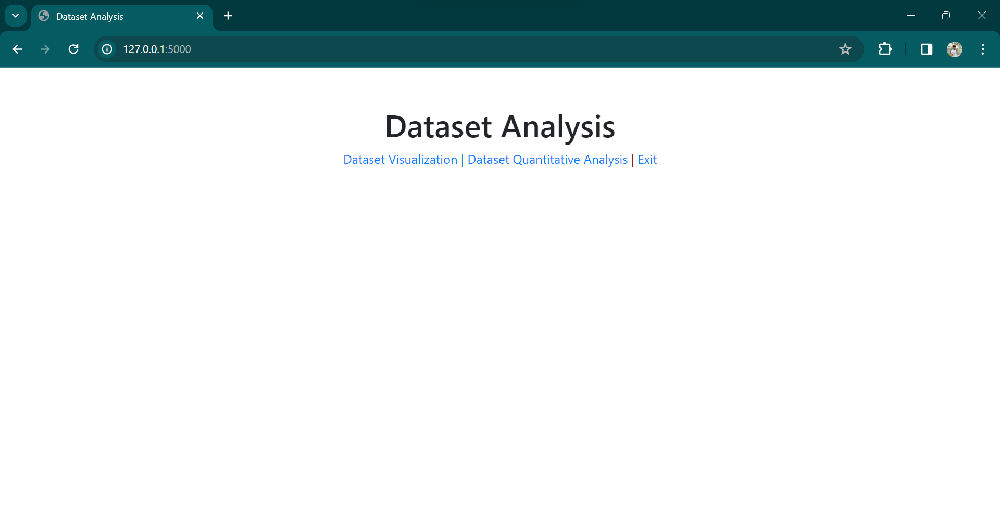
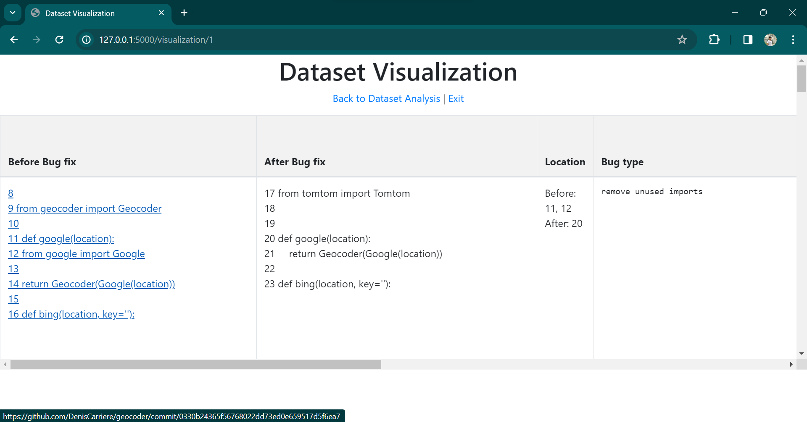

# MineCPP [](https://pypi.org/project/Minecpp/) [](LICENSE) [](https://doi.org/10.5281/zenodo.10579446)

MineCPP also known as Minecraft++ is an extension of [Minecraft](https://github.com/SET-IITGN/Minecraft)  
The dataset generated by MineCPP for 25 python projects is available at [Zenodo](https://doi.org/10.5281/zenodo.10579446)

## Table of Contents

- [Introduction](#introduction)
- [Getting Started](#getting-started)
  - [Installation](#installation)
  - [Usage](#usage)
  - [Tool's Output](#tools-output)
  - [GUI](#tools-gui)
- [Configuration](#configuration)
- [Examples](#examples)
- [Contributing](#contributing)
- [License](#license)

## Introduction

MineCPP - A tool to mine a GitHub repository and obtain a dataset containing a list of bug-fix pairs and related information. 
The tool, with the argument -U [GitHub URL], mines the repository and provides the output project_name.csv. The schema of project_name.csv contains 17 columns and each row in it represents a potential bug-fix pair.


## Getting Started

MineCPP is a python based tool. Make sure python is installed before following the [Installation](#installation) guide.

### Installation

MineCPP can be installed with a simple pip command.

```bash
# Installation command
pip install minecpp
```

All the dependencies are taken care by the installation.

### Usage
MineCPP comes with three optional arguments:
```bash
optional arguments:
  -h, --help  show this help message and exit  
  --version   show version number and exit  
  -u U        Provide the GitHub repo link to anlyse the repository
```

A GitHub URL of the repository is enough to perform analysis on the repo. Command to run it on repository is:

```
minecpp -u https://github.com/SET-IITGN/Minecraft
```

### Tool's Output
The output of the tool is a ```project_name.csv``` file. The schema of the file is:
- 'Before Bug fix': Represents the code snippet containing a bug.
- 'After Bug fix': Represents the code snippet after the bug is fixed.
- 'Location': Represents the line numbers. The 'after' field represents the line number where the bug is fixed, and 'before' represents the line number where the bug was found.
- 'Bug type': Represents the type of bug obtained from LLM using the git diff between the fixed commit and the buggy commit.
- 'Commit Message': Represents the author's description of the commit.
- 'File Path': Represents the path of the file in which the change is present or the bug is fixed.
- 'Test File': Denotes whether the test file is present for the bug. Here, 1 represents that the test file is present, and 0 represents that the test file is absent.
- 'Coding Effort': Represents the effort an author makes before a bug occurs (obtained from the AST of the source code).
- 'Constructs': Represents the type of constructs in which the bug occurred.
- 'Lizard Features Buggy': Denotes the cyclomatic complexity of the buggy file.
- 'Lizard Features Fixed': Denotes the cyclomatic complexity of the bug-fix file.
- 'BLEU', 'crystalBLEU_score', 'bert_score': Represent three different algorithms that estimate the similarity between buggy and fixed code. The similarity score lies in the range 0 to 1, where 1 indicates similarity, and 0 indicates dissimilarity.

### Tool's GUI

The tool also provides a GUI to explore and analyse the dataset. It provides two features

- Dataset Visualization: This feature is used to view the dataset and it is interactive.
- Quantitative Analysis: This feature is used to show the quantative analysis of Coding Effort vs Bug-Fix pairs and Similarity Score vs Bug-Fix pairs.


## Configuration

```
Python 3.8 or above
Needs C++ 14
```

## Examples




## Contributing

Conrtibutions are accepted. The contributions will be accepted only if they are suitable for the tool.

## License
[Apache License](LICENSE)
